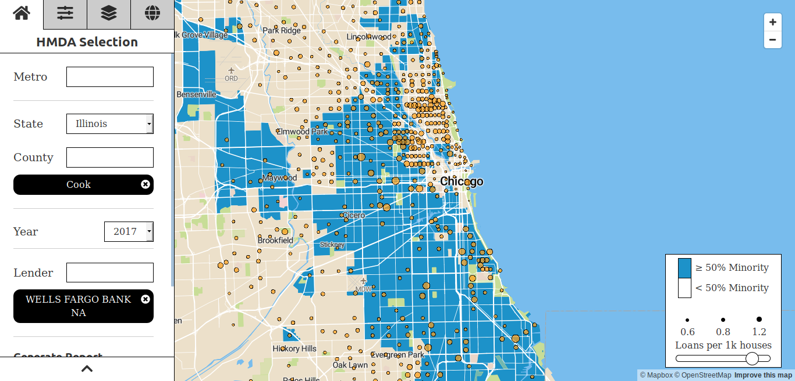

# Mapusaurus

[](https://circleci.com/gh/cmc333333/mapusaurus)




Mapusaurus is an open-source application that displays Home Mortgage
Disclosure Act data in a geo-spatial interface.


## Requirements

This currently uses:
Django 1.11
Python 3.6

You will also need:
PostgreSQL > 9.3, including 10
PostGIS

See the Pipfile (and Pipfile.lock) for more details; we recommend using
[pipenv](https://docs.pipenv.org/) for managing your dependencies.


## Setup

To create all of the relevant database tables, run:

```sh
python manage.py migrate
```

### Respondent/Institution data

Start by loading a fixture with regulator agency data:
```sh
python manage.py loaddata agency
```

Then, fetch and load the transmittal sheets and reporter data files:
```sh
python manage.py fetch_load_transmittals --year 2013
python manage.py fetch_load_reporter_panels --year 2013
```

### Geo

We next load state, county, CBSA, and census tract shape files by running:
```sh
python manage.py fetch_load_geos --year 2013
```

### FFIEC

We'll also need demographic data from the FFIEC for each tract. Fetch and load
that by running:
```sh
python manage.py fetch_load_demographics --year 2013
```

### HMDA Data

Next, we load the HMDA Loan Application Record data for each of our census
tracts:
```sh
python manage.py fetch_load_hmda --year 2013
```

### Start the app

To run the development version of the app, we need only run:
```sh
python manage.py runserver
```
